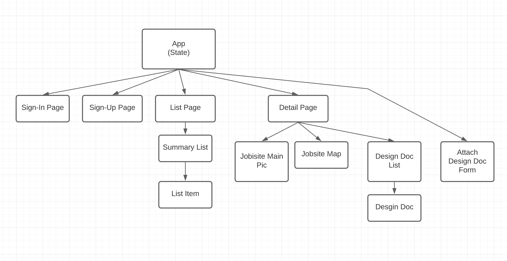

# Build Sight Pro
This project provides a website when a construction company can create jobsites, attach design documents (e.g. blue prints) to the jobsite and track acknowledgement of the design documents by the construction staff. This minimizes confusion and increases accountability.

## Use Cases
Use cases can be viewed on this Trello board:
https://trello.com/b/1ilE4sUM/buildsightpro
1. Able to create a jobsite
2. Able to attach design documents to a jobsite
3. Able to track acknowledgement of design documents by jobsite workers.

## Entity Relationships

## Component Hierarchy

## Wireframes

## Other
The hope is to host this project on AWS, or at least using an AWS/RDS hosted Postgres DB and an AWS S3 bucket for the design docs.

Also, if the project progresses to the point of supporting notifications, use AWS SES for email notifications.