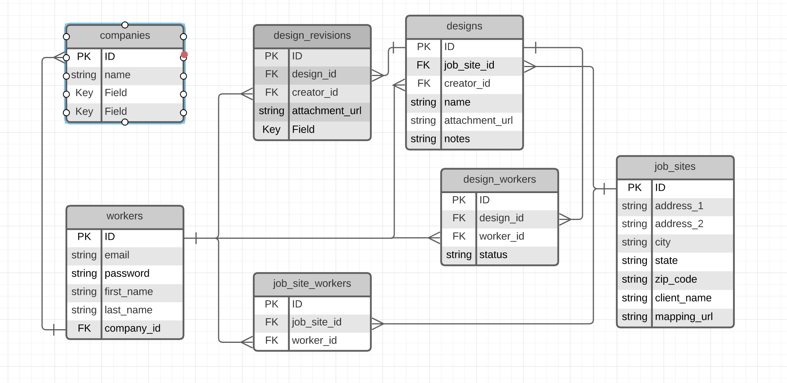

# Build Sight Pro
BuildSightPro is a multi-tennat solution for construction companies to store design specifications. It was built for a friend who had been managing their design specifications using a simple file hosting service, but was struggling with tracking acknowledgement of the specs by their staff. 
## Use Cases
1. Each company can control their list of jobsites.
2. Staff can be assigned to jobsites.
3. Specifications can be uploaded to a jobsite.
4. Staff assigned to a jobsite will receive email notifications when a new specification is uploaded to a jobsite.
5. BuildSightPro can then track the acknowledgement of specifications by each jobsite staff member.

## Technologies Used
BuildSightPro is built using:
* Node.js
* React
* MySQL
* Hosted on AWS:
    * EBS for application instance
    * RDS for database
    * S3 for specification storage
    * SES for email notifications
* Goggle API
    * Addresses resolved using Google Locate API
    * Map provided by Google Maps API

## Entity Relationships

## [Incredibly] Low-Fidelity Wireframes

